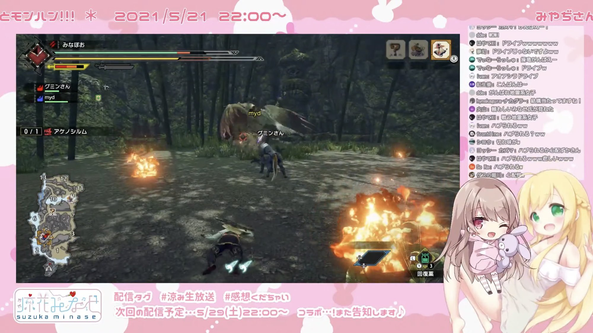

## 解説

みやぢさんとのモンハンコラボ、回復薬を飲みながら「今ジュース飲んでる」と発言。
なお、みやぢさんは戦いの最中にみなせさんがリアルでジュース飲んでると勘違いしてしまった。

龍が如くシリーズのエナジードリンク系の回復アイテムに対して使うこともある。

## 使用例

>（死にかけて）ジュースジュース！ジュース飲まなきゃ！ —2021年5月21日 涼花みなせ

## 関連リンク

- [みやぢさんと狩り♥初めてのマルチ！！【定期配信第37回】](https://youtu.be/BnILigrp7ww?t=912)
