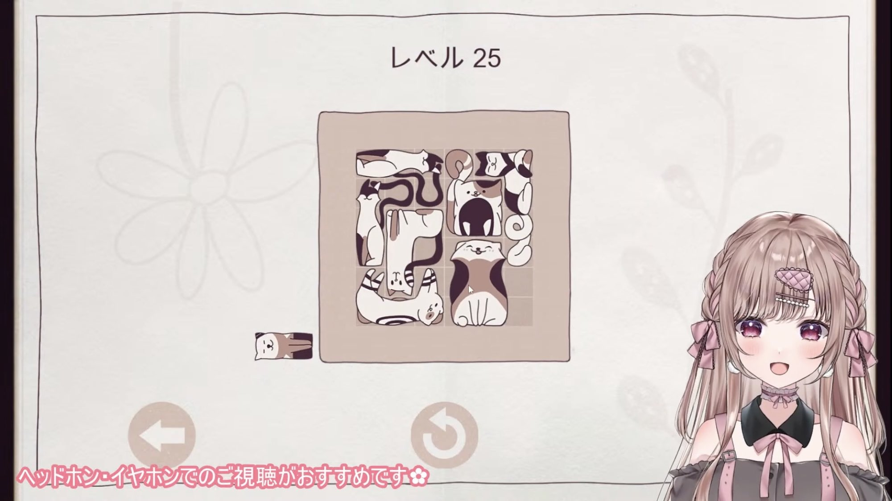

## 解説
① Cats Organized Neatlyのゲーム配信にて、あまりにもすんなり攻略してしまったみなせさんが、誰にも疑われていないにもかかわらず「私攻略サイト見てないからね！」と自ら疑惑を提起し、自ら否定をしだしたことに由来。

② やがて「攻略サイトを見るよりコメント欄に聞いた方が早い」という理由で、グ民さんたちは攻略サイトとしての扱いを受けている。ちなみに間違ったことを書くとみなせさんから責められることも...

## 使用例

> 私攻略サイト見てないからね！ —2025年5月21日 涼花みなせ

- 攻略サイトのみんなを待とう(2026年5月30日)

## 関連動画
- [深夜のゆるクラ♡ピグリン要塞に行きたい…🐷！！！【#すみっこキングダム／Minecraft】](https://www.youtube.com/live/LpkHvKg_DX8?t=1073&si=uQyIfx-u5v8NWEQR)

情報提供者：ゆうほー
