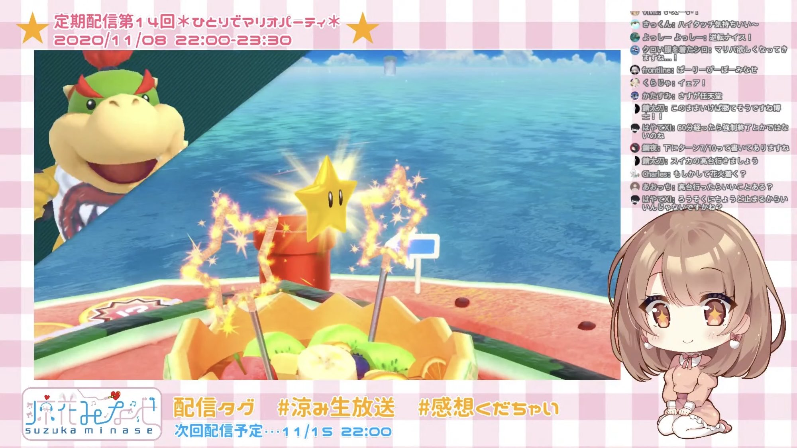

## 解説

ゲーム内のNPCのこと。人格を持たない彼らに、みなせさんの温かい人柄は一切適用されない。

## 使用例

> 無機物相手になら私は1位になれるかもしれない -2020年11月8日涼花みなせ

## 関連URL
- [こいつらってコンピューター？](https://www.youtube.com/live/fLXbsQWbGuk?si=TvnfyOO_G3NM_aI8&t=2912)
- [こいつらなら礼言わんでいいわ](https://www.youtube.com/live/fLXbsQWbGuk?si=l77RYVZ6hoBh30Ba&t=3925)
