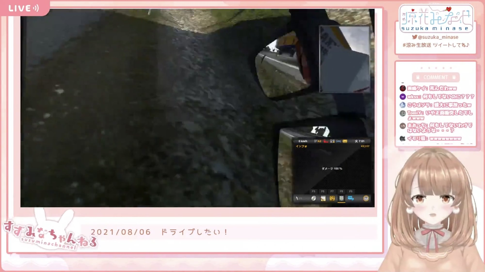

## 解説

自分は何もしていないと訴えているが、実際には大変なことをしでかしているときに用いられる。

Euro Truck Simulator 2の配信では、反対車線のトラックと正面衝突し、横転したすえに供述。

この発言に[グ民](./gumin)さんは困惑していたが、本人はあくまで「なにもしてない」らしい。

## 使用例

> あたしなにもしてないのに！！ —2021年8月6日 涼花みなせ

## 関連リンク

- [【Euro Truck Simulator 2】ドライブしたい！【定期配信第48回】](https://www.youtube.com/live/NHHqcphbeuk?t=4357)

情報提供者：ゆうほー
