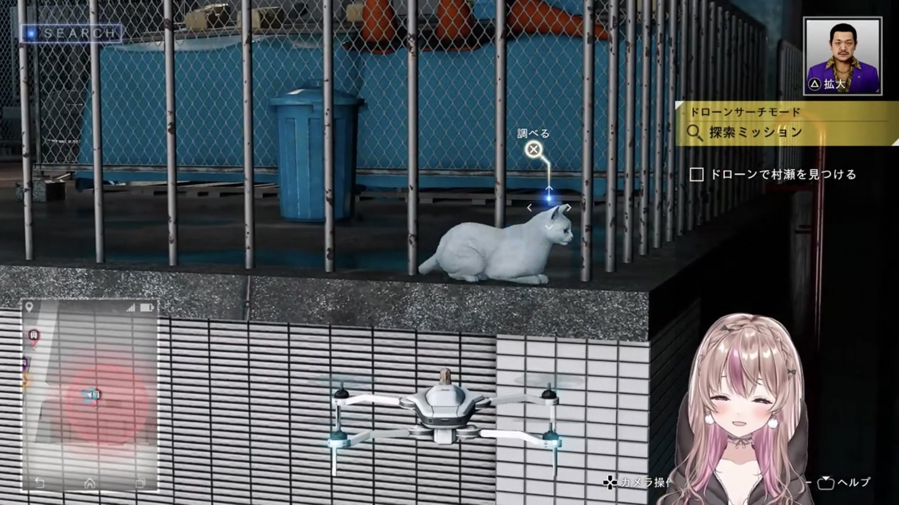

## 解説

欲しいものを手に入れた時や幸運な時、吐息たっぶりの低音で「ラッキー」と喜んでいる。

レジ係で偶然お釣りを少なく渡してしまった時もラッキーのうちである。

参考:[スーパーにバイト行きます。みゃーちゃん合流まで雑談と予習！！！【Supermarket Simulator】](https://www.youtube.com/watch?v=WhMsmoGOOyg&t=7266s)

## 使用例

> ラッキー —2025年4月14日 涼花みなせ

[俺は探偵で元弁護士だぁ～！【JUDGE EYES：死神の遺言 Remastered #2／ストーリーのネタバレ含みます】](https://www.youtube.com/watch?v=lOHAT8vQEI0&t=2247s)

## 関連リンク

[腕相撲大会＆カエル装備限定参加型延長戦🐸！詳細は概要欄みてね🌸【モンスターハンターワイルズ／ネタバレ含みます】](https://www.youtube.com/watch?v=MFnXJLPg_sc&t=6597s)

[【みやぢ×みなせ】怖がり2人で初見協力プレイ。【BIOHAZARD 5／#2】](https://www.youtube.com/watch?v=MFnXJLPg_sc&t=6597s)

情報提供者：Bullard
