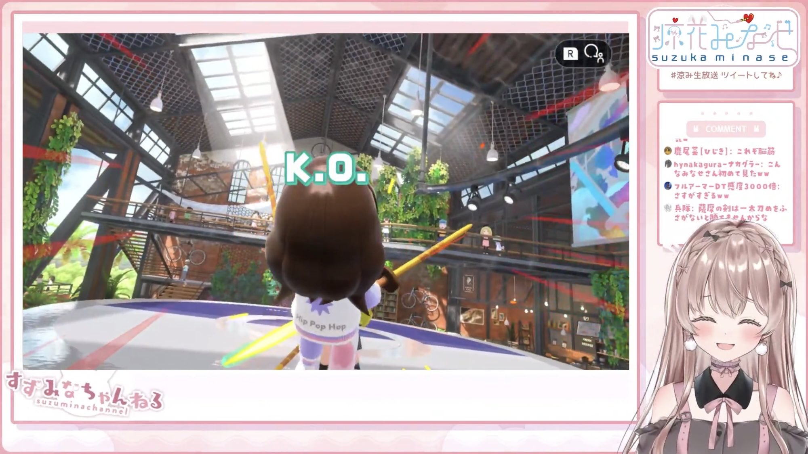

## 解説

MOMOKA。さんとのSwitchSportsコラボにて、バドミントンのコーチをしてもらっていたが、ストレート負けを喫し「もうこのバドミントンクラブは辞めます」と宣言し退部した。

また、浅木式さんとの[SwitchSportsコラボ](https://m.youtube.com/watch?v=FfY3dPu8FgE&t=4469s&pp=2AH1IpACAYoIAkAB&ra=m)でも入っては退部を繰り返しており、とうとうグ民さんに「もう入る部活がない」と言われてしまった。

ちなみにこの時の対戦成績は17戦中、式さん15勝、みなせさん2勝(チャンバラでの勝利)であり、元剣道部のみなせさんとしては充分すぎる結果を残した。

> 「もう入る部活がない」って言われた。すべて退部しちゃった -2022年6月8日 涼花みなせ

> いいんだよ、楽しければどんな部活入ってもいいんだよ -2022年6月8日 浅木式

## 使用例
- もう退部退部
- めんどくさいからジム退部しちゃった。
